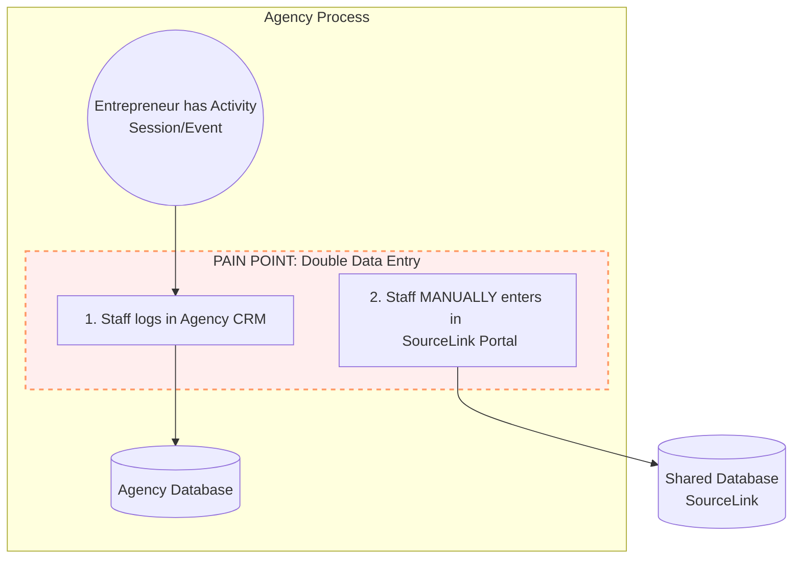

# Current State: Engagement & Activity Tracking

This diagram illustrates the workflow for processing activities (mentoring, events) for *existing* entrepreneurs in the network.
Key characteristics:
- **Trigger**: Occurs when an entrepreneur has an interaction (session, event, etc.).
- **Pain Point**: Staff must manually enter data into both the Agency CRM and the Shared Portal.

